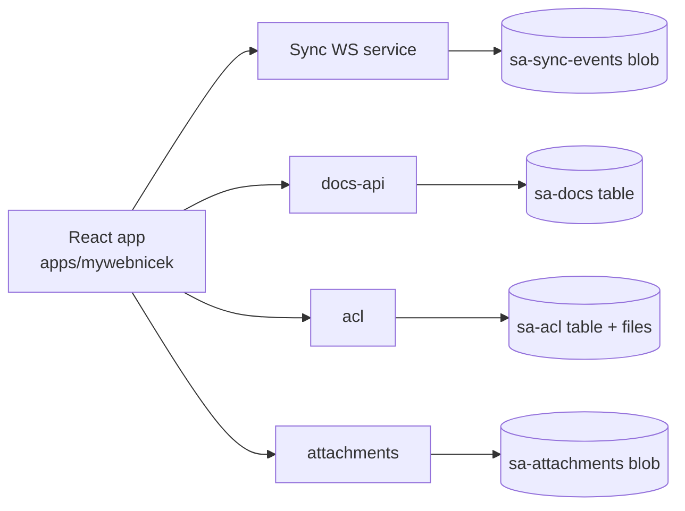
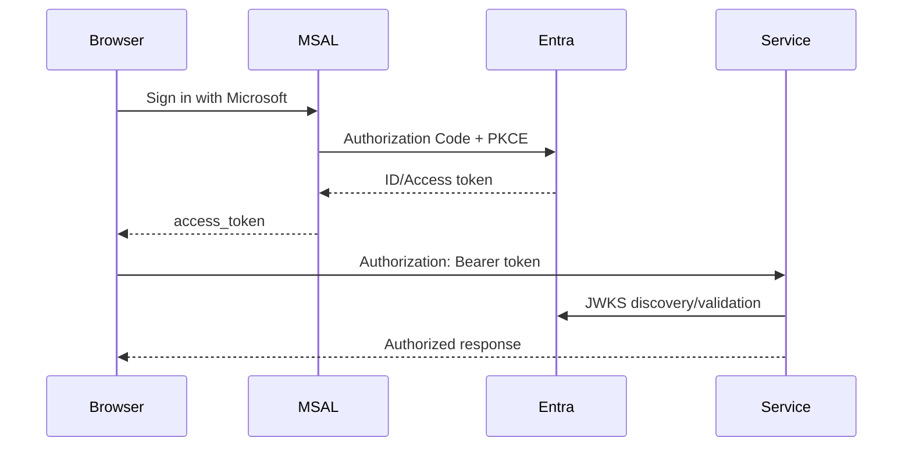

# Architecture

## Hub-spoke topology

```mermaid
flowchart LR
  Hub[Hub VNet\n10.0.0.0/16]
  Frontend[Spoke Frontend\n10.1.0.0/16\nsubnet 10.1.0.0/24]
  Sync[Spoke Sync\n10.2.0.0/16\nsubnet 10.2.0.0/24]
  API[Spoke API\n10.3.0.0/16\nsubnet 10.3.0.0/24]
  Data[Spoke Data (PE only)\n10.4.0.0/16\nsubnet 10.4.0.0/24]

  Hub --- Frontend
  Hub --- Sync
  Hub --- API
  Hub --- Data
```

## Service interaction



## Identity flow


