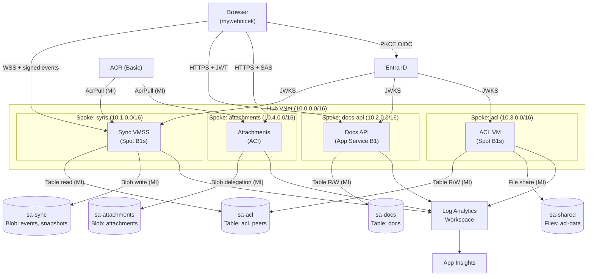
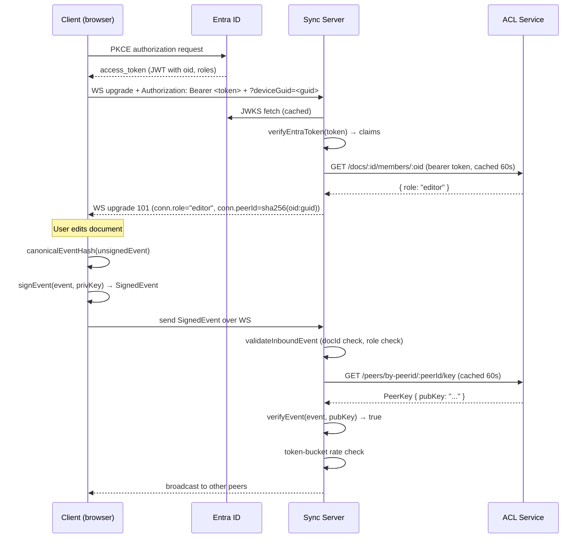

# Azure Deployment Design — mydenicek

**Status:** Draft | **Author:** krsion | **Date:** 2025-05 | **Branch:** infra/az-104

---

## 1. Overview & Non-Goals

This document describes the Azure deployment architecture for mydenicek, a CRDT-based
collaborative document editor. The deployment simultaneously:

- Covers the AZ-104 exam syllabus through hands-on practice with real Azure resources
- Provides a production-like (but cost-optimised) backend for mydenicek
- Implements CRDT security layers L1–L4: transport WSS (L1), Entra JWT auth (L2),
  ACL document authorisation (L3), Ed25519 event signing (L4)

### Non-Goals

- **L5 E2E encryption** — out of scope, documented as future work (see ADR-0010)
- **AKS, Application Gateway, Bastion, VPN Gateway, Azure Firewall** — cost exceeds
  $130/month each; covered conceptually in RUNBOOK.md
- **Full production hardening** — no HA, geo-redundancy, or blue/green deployments
- **AZ-204 / AZ-305 services** — Azure Functions, Logic Apps, API Management, Event Hub,
  Service Bus, Cosmos DB are out of scope (see ADR-0008)

---

## 2. Glossary

| Term | Definition |
|------|-----------|
| CRDT | Conflict-free Replicated Data Type — data structure that merges concurrent edits deterministically |
| OT | Operational Transformation — algorithm that transforms concurrent operations to preserve intent |
| PeerId | Stable per-device identity: SHA-256(`${oid}:${deviceGuid}`) as hex string |
| SignedEvent | CRDT event with an Ed25519 signature over the canonical event hash |
| LAW | Log Analytics Workspace |
| ACR | Azure Container Registry |
| VMSS | Virtual Machine Scale Set |
| ACI | Azure Container Instances |
| ASP | App Service Plan |
| PE | Private Endpoint |
| NSG | Network Security Group |
| ASG | Application Security Group |
| RBAC | Role-Based Access Control |
| MI | Managed Identity (system-assigned or user-assigned) |
| OIDC | OpenID Connect |
| SAS | Shared Access Signature |
| JWKS | JSON Web Key Set — endpoint that publishes public keys for JWT verification |
| Ed25519 | Edwards-curve Digital Signature Algorithm using Curve25519 |

---

## 3. Requirements

### Functional

| ID | Requirement |
|----|-------------|
| F1 | Real-time CRDT document sync over WebSockets (signed events) |
| F2 | Entra ID authentication via MSAL PKCE flow |
| F3 | Per-document authorisation: Owner / Editor / Viewer roles |
| F4 | Ed25519 event signing: every event carries an author signature verified by the sync server |
| F5 | Blob attachment upload via user-delegation SAS (no account key) |
| F6 | Distributed observability: traces span sync → docs-api → acl → attachments |

### Non-Functional

| ID | Requirement |
|----|-------------|
| N1 | Total cost ≤ $50/month (24/7); ≤ $21/month with nightly teardown |
| N2 | Spot eviction resilience: CRDT event log persisted to Blob Storage; no data loss on eviction |
| N3 | Nightly teardown at 20:00 UTC; morning spinup at 05:00 UTC (compute only) |
| N4 | 5-minute RPO for ACL VM: deallocate (not delete) on teardown; disk state preserved |
| N5 | All peers converge to identical document state given the same event set (SEC guarantee) |
| N6 | `AUTH_ENABLED=false` (default) preserves loginless demo mode; no behavior change |

### AZ-104 Domain Coverage

- **Identity & Governance**: Entra app registration, MSAL, SSPR, B2B guests, Conditional Access,
  management groups, Azure Policy, custom RBAC roles, resource locks
- **Storage**: Blob (append + block), Table, Files, SAS, lifecycle policies, soft delete,
  Key Vault with PE, AzCopy
- **Compute**: VMSS (spot, autoscale, rolling upgrade), App Service (slots, autoscale),
  VM (data disk, AMA, JIT), ACI, Recovery Services Vault, ASR
- **Networking**: Hub-spoke peering, NSG/ASG, Standard LB, private endpoints, private DNS,
  Network Watcher, NSG flow logs
- **Monitor**: LAW, App Insights, KQL, metric/log/activity alerts, Cost Management

---

## 4. High-Level Architecture

---

## 5. Detailed Design

### 5.1 Identity

**MSAL PKCE flow** (`@azure/msal-browser`) runs in the browser. No client secret is stored
anywhere in the frontend.

**Entra app registration** scopes:
- `openid`, `profile`, `email` — standard OIDC claims
- `CRDT.ReadWrite` — custom scope for document access

**App roles** (defined in the app manifest, assignable to users and groups):

| Role | Purpose |
|------|---------|
| `Owner` | Full document control including delete and member management |
| `Editor` | Read + write events; cannot delete document |
| `Viewer` | Read-only |
| `Service` | Machine-to-machine (sync → acl server-to-server calls) |
| `Admin` | Portal administration; triggers CA MFA policy |

**JWT validation** in `packages/shared-auth` using the `jose` library against the Entra
JWKS endpoint (`https://login.microsoftonline.com/{tenantId}/discovery/v2.0/keys`).
Validates: `aud`, `iss`, `exp`, `nbf`, signature.

**PeerId derivation**: `SHA-256(${oid}:${deviceGuid})` → hex string. Stable across token
refreshes; one keypair per device.

**Ed25519 keypair** stored in `localStorage` (MVP). TODO: migrate to IndexedDB or
WebAuthn hardware key (see ADR-0010 open question).

### 5.2 Network

**Address plan:**

| VNet | CIDR | Workload subnet | PE subnet |
|------|------|-----------------|-----------|
| Hub | 10.0.0.0/16 | 10.0.2.0/24 (mgmt) | 10.0.3.0/24 |
| Spoke-sync | 10.1.0.0/16 | 10.1.0.0/24 | 10.1.1.0/24 |
| Spoke-docs-api | 10.2.0.0/16 | 10.2.0.0/24 | 10.2.1.0/24 |
| Spoke-acl | 10.3.0.0/16 | 10.3.0.0/24 | 10.3.1.0/24 |
| Spoke-attachments | 10.4.0.0/16 | 10.4.0.0/24 | 10.4.1.0/24 |

**NSG/ASG rules:**
- Inbound: HTTPS (443) from Internet → sync VMSS LB, docs-api; block all else
- Inbound: WSS (443) from Internet → sync VMSS LB
- Inter-spoke: sync → acl (TCP 8080 via private endpoint); docs-api → acl (TCP 8080)
- Outbound: all services → LAW, ACR, Entra JWKS (Internet via Service Endpoints or PE)

**Private DNS zones** linked across all spokes:
- `privatelink.blob.core.windows.net`
- `privatelink.table.core.windows.net`
- `privatelink.file.core.windows.net`
- `privatelink.vaultcore.azure.net`

**Private endpoints** per service: sa-sync (blob), sa-docs (table), sa-acl (table),
sa-attachments (blob), sa-shared (file), Key Vault.

### 5.3 Compute

| Service | Type | SKU | Priority | Max instances | Notes |
|---------|------|-----|----------|---------------|-------|
| sync | VMSS | B1s | Spot | 5 | Rolling upgrade, Docker, evictionPolicy: Deallocate |
| docs-api | App Service | B1 | n/a | 3 | Slot swap staging → prod; autoscale on CPU |
| acl | VM | B1s | Spot | 1 | Data disk (ACL backups), AMA extension, JIT enabled |
| attachments | ACI | 1 vCPU / 1.5 GB | n/a | 1 | MI for user-delegation SAS; no public IP |

### 5.4 Authorization

**Azure RBAC** controls who can access Azure resources (storage accounts, ACR, Key Vault).
All service-to-resource access uses Managed Identities with built-in roles (see §RBAC matrix).

**Application RBAC** controls who can access CRDT documents. Stored in `sa-acl` Table Storage
(`acl` table: partition=docId, row=oid, value=role). The ACL service is the single source
of truth for document membership.

| Principal | Azure RBAC | App RBAC |
|-----------|------------|---------|
| Sync VMSS MI | Storage Blob Data Contributor (sa-sync), Storage Table Data Reader (sa-acl), AcrPull, Monitoring Metrics Publisher | n/a (machine identity) |
| Docs-API MI | Storage Table Data Contributor (sa-docs) | n/a |
| ACL VM MI | Storage Table Data Contributor (sa-acl), Storage File Data SMB Share Contributor (sa-shared) | n/a |
| Attachments ACI MI | Storage Blob Delegator + Data Contributor (sa-attachments), AcrPull | n/a |
| End user | Reader on RG (optional) | Owner / Editor / Viewer per document |

### 5.5 Storage

| Account | Kind | Redundancy | Services | Notes |
|---------|------|------------|----------|-------|
| sa-sync | StorageV2 | LRS | Blob: append blobs (events), block blobs (snapshots) | PE for blob; lifecycle: hot→cool→archive at 7/30/90 days |
| sa-docs | StorageV2 | LRS | Table: docs metadata | PE for table |
| sa-acl | StorageV2 | LRS | Table: acl (members), peers (PeerId→pubKey) | PE for table |
| sa-attachments | StorageV2 | LRS | Blob: binary attachments | PE for blob; no account key; lifecycle 90-day archive |
| sa-shared | StorageV2 | LRS | Files: SMB share (acl-data) | PE for file; Azure File Sync agent on acl VM |

### 5.6 Observability

- **LAW** receives logs from all resources via diagnostic settings (AMA agent on VMs,
  built-in for App Service/ACI)
- **App Insights** (workspace-based, linked to LAW) for distributed traces across all services;
  correlation IDs propagated via `traceparent` header
- **KQL queries** (6 saved in `infra/monitor/kql/`): event ingestion rate, auth failures,
  signature verification failures, spot eviction events, top documents by edit volume,
  ACL cache hit/miss ratio
- **Alerts** (5):
  1. Metric: VMSS CPU > 80% for 5 min → scale-out
  2. Metric: App Service HTTP 5xx rate > 1% → email
  3. Activity log: spot eviction event → email
  4. Activity log: role assignment change → email (security audit)
  5. Log: `SignatureVerificationFailed` count > 5 in 1 min → email + incident

### 5.7 Governance

- **Management group**: `mydenicek-learning` under tenant root group
- **Azure Policy**: `require-app-tag` — deny creation of any resource group without
  `app=mydenicek` tag
- **Custom role** `Mydenicek Operator`: `*/read`, `Microsoft.Compute/*/restart/action`,
  no write/delete on storage or identity resources; defined in `infra/shared/customRole.bicep`
- **Resource locks**: `CanNotDelete` on production RG (`rg-mydenicek-prod`)
- **Cost Management**: $50/month budget; email alert at 80% ($40)

### 5.8 Deployment & Lifecycle

**7 GitHub Actions workflows** using OIDC federated credentials (no secrets in GitHub):

| Workflow | Trigger | Purpose |
|----------|---------|---------|
| `deploy-shared.yml` | manual / push to infra/az-104 | LAW, App Insights, ACR, Key Vault, DNS zone |
| `deploy-network.yml` | manual | Hub VNet, 4 spokes, NSGs, peering, private DNS |
| `deploy-service.yml` | manual / matrix | sync, docs-api, acl, attachments |
| `deploy-monitor.yml` | manual | Alerts, workbook, diagnostic settings |
| `build-push.yml` | push to infra/az-104 | Build Docker images, push to ACR |
| `scheduled-teardown.yml` | cron `0 20 * * *` | Deallocate compute nightly |
| `scheduled-spinup.yml` | cron `0 5 * * *` | Redeploy compute each morning |

**Scheduled teardown** preserves storage; deletes/deallocates compute only.
**Winter shift** (CET, UTC+1): change cron to `0 21 * * *` / `0 6 * * *`.

### 5.9 CRDT Security

**Layer summary:**

| Layer | Threat mitigated | Mechanism |
|-------|-----------------|-----------|
| L1 Transport | T4 transport tampering | WSS (TLS 1.2+); plain WS rejected |
| L2 Authentication | T1 unauthorized read, T2 unauthorized write | Entra JWT; JWKS-verified on every WS upgrade |
| L3 Authorization | T2 unauthorized write to specific doc | ACL Table Storage; sync server checks role before accepting events |
| L4 Event signing | T3 author spoofing | Ed25519 per-device keypair; server verifies signature against ACL-stored pubKey |
| L5 E2E encryption | T5 server-side plaintext | **Deferred** — server operator can read all content |

**Signed-event roundtrip sequence:**

---

## 6. Decisions (ADR Summaries)

| ADR | Decision |
|-----|---------|
| [ADR-0001](../adr/0001-no-app-gateway-bastion-vpn.md) | Skip App Gateway, Bastion, and VPN Gateway deployment — cover conceptually only |
| [ADR-0002](../adr/0002-standard-lb-for-public-ingress.md) | Use Standard Load Balancer for public ingress instead of App Gateway |
| [ADR-0003](../adr/0003-spot-instances-everywhere.md) | Use Spot instances for all VMs/VMSS with evictionPolicy: Deallocate |
| [ADR-0004](../adr/0004-five-services-not-monolith.md) | Split into 5 services (sync, docs-api, acl, attachments, shared) for AZ-104 compute coverage |
| [ADR-0005](../adr/0005-table-storage-over-sql.md) | Use Azure Table Storage instead of SQL/Cosmos DB |
| [ADR-0006](../adr/0006-managed-identities-everywhere.md) | Use Managed Identities exclusively; no account keys or secrets in code |
| [ADR-0007](../adr/0007-feature-flag-auth.md) | Gate auth behind AUTH_ENABLED env flag; default false preserves loginless mode |
| [ADR-0008](../adr/0008-exclude-az204-305-services.md) | Exclude AZ-204/AZ-305 services (Functions, Event Hub, Cosmos DB, etc.) from scope |
| [ADR-0009](../adr/0009-scheduled-teardown-and-spinup.md) | Nightly teardown at 20:00 UTC + morning spinup at 05:00 UTC to stay ≤ $21/month |
| [ADR-0010](../adr/0010-crdt-security-model.md) | Implement L1–L4 security; defer L5 E2E encryption |

---

## 7. Cost Model

| Resource | SKU | $/month (13h/day, Mon–Fri) | $/month (24/7) |
|----------|-----|---------------------------|----------------|
| Sync VMSS B1s | Spot ~70% discount | ~$2 | ~$7 |
| Docs-api App Service B1 | n/a | ~$3 | ~$13 |
| ACL VM B1s | Spot ~70% discount | ~$2 | ~$7 |
| Attachments ACI | 1 vCPU / 1.5 GB | ~$1 | ~$4 |
| ACR Basic | n/a | $5 | $5 |
| LAW | PerGB2018, ~1 GB/day | ~$3 | ~$8 |
| Storage (5 accounts) | LRS | ~$1 | ~$2 |
| Standard LB (2×) | n/a | ~$4 | ~$4 |
| **Total** | | **~$21** | **~$50** |

---

## 8. Risks

| Risk | Likelihood | Impact | Mitigation |
|------|-----------|--------|-----------|
| Spot eviction during demo | Medium | Medium | CRDT event log persisted to Blob; re-run `deploy-service.yml` to respawn |
| Key Vault PE DNS misconfiguration | Low | High | Monitor with Network Watcher IP flow verify; verify PE DNS registration in Bicep |
| CRDT convergence with revoked signing keys | Low | Low | Events signed before revocation are accepted (one-way upgrade semantics); no retroactive invalidation |
| Budget overrun | Low | Medium | $50/month hard budget in Cost Management; 80% alert; nightly teardown as backstop |

---

## 9. Open Questions

1. Should Key Vault secrets rotation be automated via Event Grid triggers?
2. Should the Ed25519 keypair be migrated from `localStorage` to a WebAuthn hardware key
   for stronger device binding?
3. Should L5 (E2E encryption) use the Signal Protocol (double-ratchet) or MLS
   (Messaging Layer Security, RFC 9420) when eventually implemented?

---

## 10. Out-of-Scope / Future Work

- **L5 E2E encryption** — server operator can currently read all document content (see ADR-0010)
- **AKS migration** — when throughput demands exceed App Service + VMSS
- **Geo-redundancy / Azure paired regions active-active** — not justified at current scale
- **Bastion host / VPN Gateway** — covered conceptually; not deployed (cost)
- **Azure Firewall + Application Gateway** — covered conceptually; not deployed (cost)
- **Full CI/CD with automated testing on Azure** — currently manual deploy; no integration tests
  run against the live environment

---

## 11. Appendix

### References

- [AZ-104 Study Guide](https://learn.microsoft.com/en-us/credentials/certifications/azure-administrator/)
- [@noble/ed25519](https://github.com/paulmillr/noble-ed25519) — Ed25519 signing library
- [jose](https://github.com/panva/jose) — JWKS/JWT validation library
- [MSAL Browser](https://github.com/AzureAD/microsoft-authentication-library-for-js) — MSAL PKCE flow
- [Bicep documentation](https://learn.microsoft.com/en-us/azure/azure-resource-manager/bicep/)
- [Azure Private Endpoint DNS](https://learn.microsoft.com/en-us/azure/private-link/private-endpoint-dns)

### Change Log

| Version | Date | Author | Change |
|---------|------|--------|--------|
| 0.1 | 2025-05 | krsion | Initial draft |
