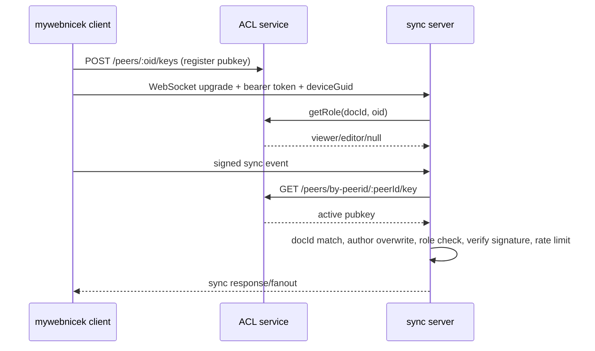

# Azure Deployment Design

## 5.9 CRDT security (L1–L4)

When auth is enabled, signed CRDT events flow through identity, ACL, and
signature checks.

L5 end-to-end encryption is intentionally deferred.
